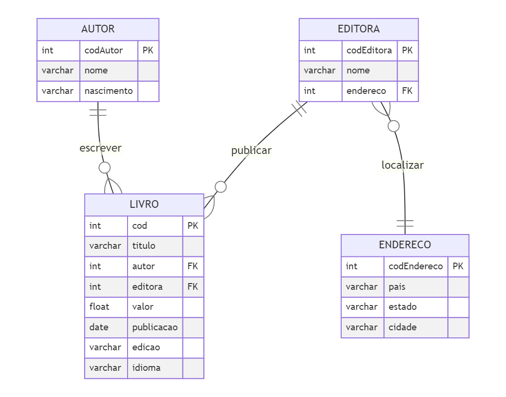

# Exercícios de Data & Analytics

## Seção 3: Linguagem SQL - Exercícios - Caso estudo de "Biblioteca"

Para os exercícios desta seção foi usada a base dados da **Biblioteca** ilustrada na imagem a seguir:

<b>Exercício 1</b>

Apresente a query para listar todos os livros publicados após 2014. 
Ordenar pela coluna cod, em ordem crescente, as linhas.  
Atenção às colunas esperadas no resultado final:\
cod, titulo, autor, editora, valor, publicacao, edicao, idioma

[Tarefa](https://github.com/telmacarvalho/programa_de_bolsas_compass/blob/main/SQL/Data_%26_Analytics/Ex_1.sql)

<b>Exercício 2</b>

Apresente a query para listar os 10 livros mais caros. 
Ordenar as linhas pela coluna valor, em ordem decrescente.  
Atenção às colunas esperadas no resultado final:  titulo, valor.

[Tarefa](https://github.com/telmacarvalho/programa_de_bolsas_compass/blob/main/SQL/Data_%26_Analytics/Ex_2.sql)

<b>Exercício 3</b>

Apresente a query para listar as 5 editoras com mais livros na biblioteca.\
O resultado deve conter apenas as colunas quantidade, nome, estado e cidade.\
Ordenar as linhas pela coluna que representa a quantidade de livros em ordem decrescente.

[Tarefa](https://github.com/telmacarvalho/programa_de_bolsas_compass/blob/main/SQL/Data_%26_Analytics/Ex_3.sql)

<b>Exercício 4</b>

Apresente a query para listar a quantidade de livros publicada por cada autor.\
Ordenar as linhas pela coluna nome (autor), em ordem crescente.\
Além desta, apresentar as colunas codautor, nascimento e quantidade 
(total de livros de sua autoria).

[Tarefa](https://github.com/telmacarvalho/programa_de_bolsas_compass/blob/main/SQL/Data_%26_Analytics/Ex_4.sql)

<b>Exercício 5</b>

Apresente a query para listar o nome dos autores que publicaram 
livros através de editoras NÃO situadas na região sul do Brasil.\
Ordene o resultado pela coluna nome, em ordem crescente.

[Tarefa](https://github.com/telmacarvalho/programa_de_bolsas_compass/blob/main/SQL/Data_%26_Analytics/Ex_5.sql)

<b>Exercício 6</b>

Apresente a query para listar o autor com maior número de livros publicados.\
O resultado deve conter apenas as colunas codautor, nome, quantidade_publicacoes.

[Tarefa](https://github.com/telmacarvalho/programa_de_bolsas_compass/blob/main/SQL/Data_%26_Analytics/Ex_6.sql)

<b>Exercício 7</b>

Apresente a query para listar o nome dos autores com nenhuma publicação.\
Apresentá-los em ordem crescente.

[Tarefa](https://github.com/telmacarvalho/programa_de_bolsas_compass/blob/main/SQL/Data_%26_Analytics/Ex_7.sql)

## Seção 4: Linguagem SQL - Exercícios - Caso estudo de "Loja"

Para os exercícios desta seção foi sendo usada a base dados da **Loja** ilustrada na imagem a seguir:

<b>Exercício 8</b>

Apresente a query para listar o código e o nome do vendedor com 
maior número de vendas (contagem) e que estas vendas estejam com o status concluída.\
As colunas presentes no resultado devem ser, portanto, cdvdd e nmvdd.

[Tarefa](https://github.com/telmacarvalho/programa_de_bolsas_compass/blob/main/SQL/Data_%26_Analytics/Ex_8.sql)

<b>Exercício 9</b>

Apresente a query para listar o código e nome do produto mais vendido entre as datas de 2014-02-03 até 2018-02-02, e que estas vendas estejam com o status concluída.\
As colunas presentes no resultado devem ser cdpro e nmpro.

[Tarefa](https://github.com/telmacarvalho/programa_de_bolsas_compass/blob/main/SQL/Data_%26_Analytics/Ex_9.sql)

<b>Exercício 10</b>

 
A comissão de um vendedor é definida a partir de um percentual sobre o total de vendas (quantidade * valor unitário) por ele realizado.\
O percentual de comissão de cada vendedor está armazenado na coluna perccomissao, tabela tbvendedor.\
Com base em tais informações, calcule a comissão de todos os vendedores, considerando todas as vendas armazenadas na base de dados com status concluído.\
As colunas presentes no resultado devem ser vendedor, valor_total_vendas e comissao. O valor de comissão deve ser apresentado em ordem decrescente arredondado na segunda casa decimal.

[Tarefa](https://github.com/telmacarvalho/programa_de_bolsas_compass/blob/main/SQL/Data_%26_Analytics/Ex_10.sql)

<b>Exercício 11</b>

Apresente a query para listar o código e nome cliente com maior gasto na loja.\
As colunas presentes no resultado devem ser cdcli, nmcli e gasto, esta última representando o somatório das vendas (concluídas) atribuídas ao cliente.

[Tarefa](https://github.com/telmacarvalho/programa_de_bolsas_compass/blob/main/SQL/Data_%26_Analytics/Ex_11.sql)

<b>Exercício 12</b>

Apresente a query para listar código, nome e data de nascimento dos dependentes do vendedor com menor valor total bruto em vendas (não sendo zero).\
As colunas presentes no resultado devem ser cddep, nmdep, dtnasc e valor_total_vendas.\
Observação: Apenas vendas com status concluído.

[Tarefa](https://github.com/telmacarvalho/programa_de_bolsas_compass/blob/main/SQL/Data_%26_Analytics/Ex_11.sql)

<b>Exercício 13</b>

Apresente a query para listar os 10 produtos menos vendidos pelos canais de E-Commerce ou Matriz (Considerar apenas vendas concluídas).\
As colunas presentes no resultado devem ser cdpro, nmcanalvendas, nmpro e quantidade_vendas.

[Tarefa](https://github.com/telmacarvalho/programa_de_bolsas_compass/blob/main/SQL/Data_%26_Analytics/Ex_13.sql)

<b>Exercício 14</b>

Apresente a query para listar o gasto médio por estado da federação.\
As colunas presentes no resultado devem ser estado e gastomedio.\
Considere apresentar a coluna gastomedio arredondada na segunda casa decimal e ordenado de forma decrescente.\
Observação: Apenas vendas com status concluído.

[Tarefa](https://github.com/telmacarvalho/programa_de_bolsas_compass/blob/main/SQL/Data_%26_Analytics/Ex_14.sql)

<b>Exercício 15</b>

Apresente a query para listar os códigos das vendas identificadas como deletadas.\
Apresente o resultado em ordem crescente.

[Tarefa](https://github.com/telmacarvalho/programa_de_bolsas_compass/blob/main/SQL/Data_%26_Analytics/Ex_15.sql)

<b>Exercício 16</b>

Apresente a query para listar a quantidade média vendida de cada produto agrupado por estado da federação.\
As colunas presentes no resultado devem ser estado, nmpro e quantidade_media.\
Considere arredondar o valor da coluna quantidade_media na quarta casa decimal.\
Ordene os resultados pelo estado (1º) e nome do produto (2º).\
Observação: Apenas vendas com status concluído.

[Tarefa](https://github.com/telmacarvalho/programa_de_bolsas_compass/blob/main/SQL/Data_%26_Analytics/Ex_16.sql)

## Seção 6 : Linguagem SQL - Desafio de Exportação de dados

<b>Tarefa 1</b>

Considerando a base de dados Biblioteca apresentada na Seção 3, realize a exportação de dados (em formato .CSV) através do cliente SQL de sua preferência (DBeaver, VSCode...).  O layout dos arquivos, bem como os critérios de coleta de dados estão definidos em cada uma das questões da atividade.

Perguntas dessa tarefa\
Exportar o resultado da query que obtém os 10 livros mais caros para um arquivo CSV. Utilizar o caractere ; (ponto e vírgula) como separador.\Lembre-se que o conteúdo do seu arquivo deverá respeitar a sequência de colunas e seus respectivos nomes de cabeçalho que listamos abaixo:

CodLivro

Titulo

CodAutor

NomeAutor

Valor

CodEditora

NomeEditora

Segue abaixo link do arquivo no formato .csv (referente a query dos 10 livros mais caros) conforme solicitado:
https://github.com/aasouzaconsult/programabolsas/blob/main/arquivo1.csv

[Tarefa](https://github.com/telmacarvalho/programa_de_bolsas_compass/blob/main/SQL/Data_%26_Analytics/Tarefa_Exportacao_1.sql)\
[Resultado](https://github.com/telmacarvalho/programa_de_bolsas_compass/blob/main/SQL/Data_%26_Analytics/10_livros_mais_caros.csv)

<b>Tarefa 2</b>

Exportar o resultado da query que obtém as 5 editoras com maior quantidade de livros na biblioteca para um arquivo CSV. Utilizar o caractere | (pipe) como separador. Lembre-se que o conteúdo do seu arquivo deverá respeitar a sequência de colunas e seus respectivos nomes de cabeçalho que listamos abaixo:

CodEditora

NomeEditora

QuantidadeLivros

Segue abaixo link do arquivo no formato .csv (referente a query das 5 editoras com maior quantidade de livros na biblioteca) conforme solicitado:
https://github.com/aasouzaconsult/programabolsas/blob/main/arquivo2.csv

[Tarefa](https://github.com/telmacarvalho/programa_de_bolsas_compass/blob/main/SQL/Data_%26_Analytics/Tarefa_Exportacao_2.sql)\
[Resultado](https://github.com/telmacarvalho/programa_de_bolsas_compass/blob/main/SQL/Data_%26_Analytics/5_editoras_com_maior_quantidade_de_livros.csv)