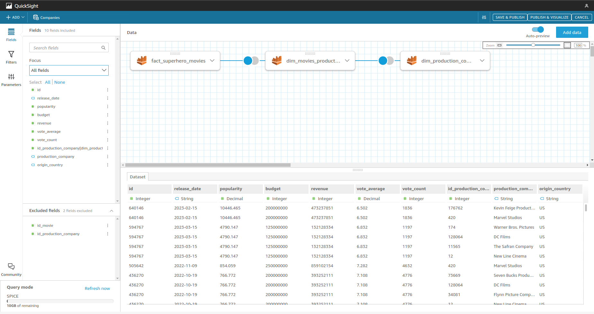

# Desenvolvimento das atividades da Sprint 10

## Data & Analytics - PB - AWS 9/10

- Tarefa 1: Desafio Parte 4 - Consumo e Apresentação dos Dados

## Desenvolvimento detalhado de cada atividade

### Tarefa 1: Desafio Parte 4 - Consumo e Apresentação dos Dados

<b>Instruções da tarefa</b>

Chegamos na última etapa do desafio. Até este ponto, suas atividades no data lake foram voltadas à ingestão e preparação dos dados. Agora é momento de extrair insights, apresentando-os através de uma ferramenta de visualização de dados (QuickSight).

Para tal, você deverá criar um dashboard no AWS QuickSight, utilizando como fonte de dados as tabelas que estão na camada Refined do data lake. Considere utilizar o Athena para como tipo de datasource.

Seu dashboard deve conter, no mínimo 3 tipos de gráficos diferentes.

**Perguntas dessa tarefa**

1. No AWS QuickSight:

- criar as  fonte de dados para o AWS Athena.

- criar visualizações

- publicar seus dashboards, compartilhando-os com seu monitor

Certifique-se que os dados consumidos estejam na versão final para evitar retrabalho.

**Dashboard:**

**Datasets:**

