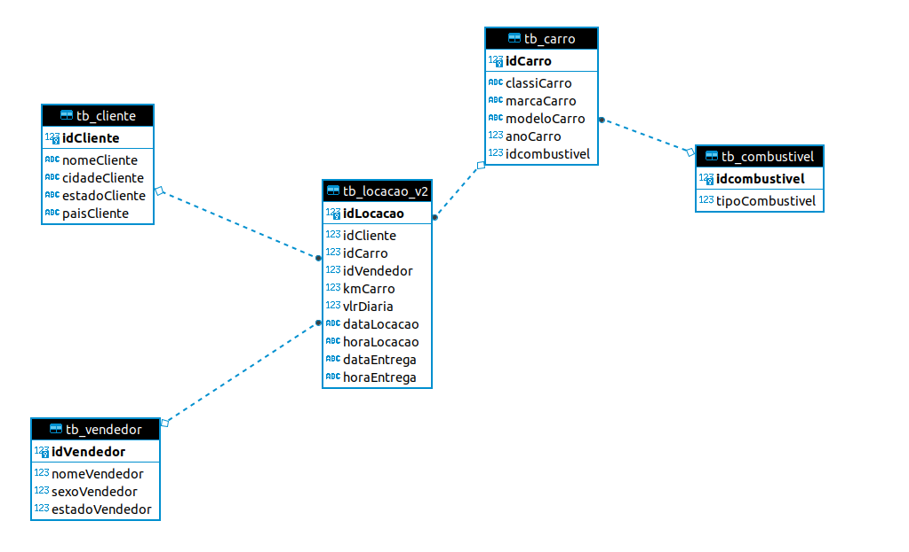
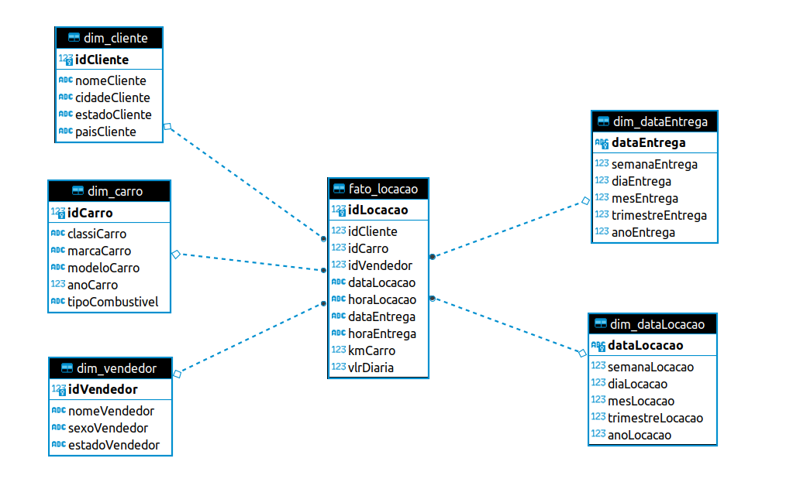

# Desenvolvimento das atividades da Sprint 9

## Data & Analytics - PB - AWS 9/10

- [Tarefa 1: Modelagem Relacional - Normalização](https://github.com/telmacarvalho/programa_de_bolsas_compass/blob/main/Sprint_9/Tarefa_1.sql)

- [Tarefa 2: Modelagem Dimensional - Criação de Modelo](https://github.com/telmacarvalho/programa_de_bolsas_compass/blob/main/Sprint_9/Tarefa_2.sql)

- Tarefa 3: Desafio Parte 3 - Processamento da Trusted

- Tarefa 4: Desafio Parte 3 - Modelagem de dados da Refined

- Tarefa 5: Desafio Parte 3 - Processamento da Refined

## Desenvolvimento detalhado de cada atividade

### Tarefa 1: Modelagem Relacional - Normalização

<b>Instruções da tarefa</b>

Aqui você irá praticar conceitos de Modelagem relacional que estudou anteriormente. Estaremos considerando a base de dados Concessionaria, cujo modelo é apresentado na Modelagem Lógica abaixo.

**O desafio é normalizar esta base de dados, ou seja, aplicar as formas normais.**

Observações:

- Para auxiliar na resolução, você poderá baixar o arquivo contendo o banco de dados (concessionaria.zip) para seu computador, e, com auxílio de algum cliente SQL, executar as queries localmente. Lembre-se de descompactar o arquivo antes.

    - São exemplos de clientes SQL o DBeaver, SQLiteStudio e DataGrip. O primeiro costuma ser utilizado com maior frequência.

Perguntas dessa tarefa

1. **Adicione sua resposta (formato .SQL) ao seu repositório Git na respectiva Sprint e coloque abaixo o link do GitHub onde o(s) arquivos SQL estão salvos.**

Não é obrigatório, mas seria interessante:

- uma explicação breve dos passos seguidos para a normalização (aqui na janela abaixo)

- o desenho da Modelagem Lógica após a normalização. (anexado aqui abaixo)

[Query](https://github.com/telmacarvalho/programa_de_bolsas_compass/blob/main/Sprint_9/Tarefa_1.sql)

**Modelagem logica:**

### Tarefa 2: Modelagem Dimensional - Criação de Modelo

<b>Instruções da tarefa</b>

Aqui você irá praticar conceitos de Modelagem Dimensional que estudou anteriormente. Estaremos considerando a base de dados Concessionaria, cujo modelo será o criado por vocês na seção anterior (Modelagem Relacional).

**O desafio é montar o Modelo Dimensional com base no Modelo Relacional (normalizado - feito por vocês) na seção anterior.**

Observações:

Dica: Criar views para fatos e dimensões

Perguntas dessa tarefa

1. **Adicione sua resposta (formato .SQL) ao seu repositório Git na respectiva Sprint e coloque abaixo o link do GitHub onde o(s) arquivos SQL estão salvos.**

Não é obrigatório, mas seria interessante:

- o desenho da Modelagem Dimensional (anexado aqui abaixo)  '

[Query](https://github.com/telmacarvalho/programa_de_bolsas_compass/blob/main/Sprint_9/Tarefa_2.sql)

**Modelagem dimensional:**

